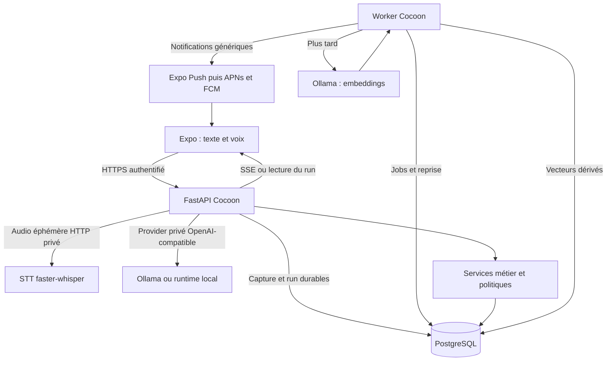

# Cocoon — plan directeur de l’assistant personnel

Révision : 19 septembre 2026. **Architecture cible et travail à réaliser, pas attestation de disponibilité.**

## 1. Objectif et documents de référence

Cocoon aide chaque membre d’une famille à déposer une information sans la classer, à retrouver son contexte et à décider quoi en faire. Chaque compte possède son assistant, son historique, sa mémoire et ses autorisations. Appartenir à la même famille ne donne aucun accès aux données personnelles des autres.

L’expérience centrale est : **capturer → comprendre dans le contexte personnel → répondre ou clarifier → proposer → confirmer → exécuter → retrouver et suivre**.

Un assistant utile nécessite davantage qu’un LLM et des vecteurs : continuité des échanges, mémoire sourcée, outils métier, contrôle des effets et exécution fiable des actions différées.

| Document | Responsabilité |
| --- | --- |
| [PLAN.md](PLAN.md) | Objectif, fonctionnalités, technologies, architecture, critères bêta |
| [CAPTURE_MODULE_PLAN.md](CAPTURE_MODULE_PLAN.md) | Parcours texte/voix, états, contrats, cas d’acceptation |
| [HERMES_INTEGRATION_PLAN.md](HERMES_INTEGRATION_PLAN.md) | Document de référence historique ; Hermes n’est pas intégré au MVP |
| [docs/PROJECT_AUDIT.md](docs/PROJECT_AUDIT.md) | Code observé, écarts et limites de validation |
| [TASKS.md](TASKS.md) | Unique roadmap exécutable avec dépendances et preuves |

Les versions précédentes sont archivées dans `docs/archive/2026-09-19/`. Le présent plan remplace la priorité « messagerie cachée d’abord » et les roadmaps précédentes, y compris celle de `docs/ASSISTANT_ARCHITECTURE.md`. Pour la capture, il remplace les anciennes prescriptions de redirection vers une page assistant et de trois signaux obligatoires sur l’accueil. Les protections des données restent applicables.

## 2. Fonctionnalités et périmètre bêta

Hypothèse initiale : 5 à 20 comptes invités, 1 à 3 demandes simultanées, français, iOS et Android, serveur personnel disponible en continu. Ce sont des objectifs de test, pas la capacité mesurée du matériel actuel. **La voix fait partie de la bêta ; les embeddings peuvent suivre.**

| Fonction | Comportement attendu pour la bêta |
| --- | --- |
| Accueil | Un champ texte et un bouton micro à maintenir ; réponse/propositions sous le champ ; accès discret à l’historique, aux éléments enregistrés et aux réglages |
| Capture universelle | Note, question, projet, tâche ou plusieurs intentions dans un texte, sans choix de catégorie |
| Voix | Enregistrement pendant l’appui, arrêt au relâchement, transcription modifiable puis envoi explicite |
| Dialogue contextuel | Comprendre « décale-le à 18 h » avec le tour précédent ; demander lequel si ambigu |
| Mémoire personnelle | Proposer de retenir un fait ou une préférence ; retrouver les éléments confirmés avec leurs sources ; corriger et oublier |
| Tâches et notes | Créer, consulter, modifier, terminer ; changement initié par le modèle soumis à confirmation |
| Agenda interne | Rendez-vous, vérification des conflits, distinction heure d’événement / heure de rappel |
| Rappels | Uniques et récurrences simples, modification/annulation, échéances consultables même sans push |
| Courses | Ajouter à une liste choisie, consulter les articles existants ; aucune commande commerciale |
| Préparation | Petite checklist, lot explicite d’actions cohérentes |
| Suivi | Brief quotidien facultatif à heure choisie ; rattrapage après panne ; pas de nouvelles actions autonomes non autorisées |
| Confiance | Statut réel : enregistré, à confirmer, exécuté, échoué ; aucune annonce d’exécution fondée seulement sur le texte du LLM |
| Comptes | Invitations, connexion, révocation d’appareils, confidentialité, export et suppression |

Une question peut recevoir une réponse sans action. Une incertitude appelle une précision. Plusieurs intentions liées peuvent produire un lot ; elles ne sont pas forcément des choix exclusifs.

Exemples de référence :

- « Paul vient dîner mardi à 19 h, prévoir les courses » : identifier la date locale, consulter l’agenda, proposer événement et préparation.
- « Je préfère des repas végétariens » : proposer une préférence durable, utilisée lors des prochaines demandes après confirmation.
- « Qu’est-ce que j’avais prévu mardi ? » : lire agenda/tâches autorisés et citer les objets retrouvés.
- « Finalement à 20 h » : proposer la modification du rendez-vous du contexte et revalider son état lors de la confirmation.
- « Rappelle-moi les poubelles tous les jeudis à 20 h » : proposer une règle explicite et exécuter les occurrences sans LLM à chaque échéance.

Après la bêta : recherche sémantique, compétences proposées par l’agent, documents/images avec OCR, agenda externe, e-mail en lecture consentie, connecteurs domestiques et actions externes. Ajouter un connecteur à la fois avec ses droits, tests et limites.

Le fil familial, les albums, la messagerie enrichie et les salons cachés ne bloquent pas l’assistant. Désactiver côté serveur et mobile les surfaces non validées dans la bêta, sans supprimer leur code ni affaiblir leurs contrôles. Aucune conversation familiale/cachée ni ses métadonnées n’entre dans le contexte assistant. Le suivi sportif reste factuel et non médical.

## 3. Technologies et responsabilités

| Brique | Technologie retenue | Rôle et conséquence |
| --- | --- | --- |
| Application | Expo, React Native, TypeScript, Expo Router existants | Réutiliser la base ; builds installables pour les testeurs |
| État mobile | TanStack Query, Zustand, SecureStore | Serveur / interface / petits secrets séparés ; caches liés au compte et purgés au logout |
| Voix | `expo-audio`, STT privé basé sur faster-whisper | Choisir le modèle par mesure du français, des noms et dates sur le matériel réel |
| API | FastAPI, Pydantic, SQLAlchemy 2, Alembic | Monolithe modulaire ; services métier extraits des routeurs, validations centralisées |
| Moteur agent | Provider local OpenAI-compatible derrière FastAPI | Le serveur construit le contexte, applique les politiques et conserve les propositions ; aucun runtime Hermes dans le MVP |
| Dialogue | Ollama auto-hébergé | Appelé seulement côté serveur ; garder le modèle actuel pour la mesure initiale, puis comparer exactitude/outils/latence/mémoire |
| Données et mémoire | PostgreSQL + JSONB | Référence unique des objets métier et des souvenirs confirmés ; recherche SQL/plein texte en bêta |
| Vecteurs ultérieurs | Modèle d’embedding dédié via Ollama + pgvector | Index dérivé dans la même base, versionné et reconstruisible ; pas de base vectorielle séparée au départ |
| Travail différé | Worker issu du code API + file PostgreSQL durable | Baux, reprise, tentatives, échéances, erreurs et déduplication |
| Réponses progressives | REST + SSE ; polling de reprise | Le mobile peut retrouver le résultat après coupure ; WebSocket réservé à la messagerie existante |
| Notifications | `expo-notifications` à intégrer, Expo Push vers APNs/FCM | Enregistrement par appareil, tickets/reçus, gestion des jetons invalides |
| Infrastructure | Linux, Docker Compose, Caddy HTTPS | Déploiement simple ; développement local possible sans Docker |
| Redis retiré du Compose | Limites partagées et éventuel Pub/Sub | Ne le réintroduire que si un besoin mesuré le justifie ; pas de seconde file de rappels concurrente |
| Fichiers ultérieurs | Adaptateur S3 | Non requis pour l’audio éphémère ; ACL et métadonnées SQL, URLs temporaires, quotas |
| Qualité | pytest, PostgreSQL de test, Ruff, TypeScript, ESLint, CI | Tests déterministes séparés des évaluations réelles Ollama/STT/push |
| Exploitation | Logs JSON, métriques, sondes et alertes | Corrélation par run sans contenu privé par défaut |

faster-whisper est un moteur STT : un petit service HTTP compatible avec `voice.py` et une normalisation audio restent à réaliser. [Source officielle](https://github.com/SYSTRAN/faster-whisper).

Ollama expose la génération d’embeddings ; modèle conversationnel et modèle d’embedding ont deux configurations distinctes. [Documentation Ollama](https://github.com/ollama/ollama/blob/main/docs/capabilities/embeddings.mdx). pgvector permet une recherche exacte puis, si nécessaire, indexée ; commencer sur le sous-ensemble autorisé et mesurer avant optimisation. [Documentation pgvector](https://github.com/pgvector/pgvector).

Les push doivent être validés dans un build adapté et leurs reçus traités : HTTP 200 ne prouve pas une livraison. [Configuration Expo](https://docs.expo.dev/push-notifications/push-notifications-setup/), [tickets et reçus](https://docs.expo.dev/push-notifications/sending-notifications/).

## 4. Architecture et communications

Caddy est l’unique entrée Internet devant FastAPI. Le worker, le provider local, le STT et PostgreSQL restent privés. Le mobile ne contacte jamais directement le modèle ni les outils.

### Modules internes à consolider

1. **CaptureService** : persister l’entrée brute, dédupliquer et démarrer le run.
2. **RunService** : états, budgets, annulation, reprise et échanges runtime ; une exécution active par session, attente bornée pour les suivantes.
3. **ContextService** : tour courant, résumé sourcé, données structurées pertinentes et souvenirs autorisés dans un budget de tokens. Une source récupérée est une donnée, jamais une politique de sécurité.
4. **ProviderAdapter** : résultats typés du provider local OpenAI-compatible ; aucune bascule silencieuse et aucun runtime Hermes.
5. **ToolRegistry / PolicyService** : schémas, droits, délais et quotas revérifiés à chaque appel.
6. **ProposalService / Executor** : propositions immuables, confirmation, contrôle de version et journal des effets.
7. **MemoryService** : provenance, confirmation, correction, oubli et recherche ; index vectoriel reconstruisible.
8. **Scheduler / NotificationService** : échéances et envoi sans dépendre du LLM pour une règle déjà confirmée.

### Flux d’un tour

1. Le mobile transmet texte, clé d’envoi et fuseau ; l’API déduit le compte du token.
2. Une transaction crée capture, run et job ; l’accusé ne part qu’après commit.
3. Le worker prend un bail, charge les droits et construit le contexte. Aucun verrou SQL long pendant l’inférence.
4. Le provider local utilise uniquement le contexte et les lectures/propositions autorisées, via les services Cocoon.
5. Les événements sûrs et le résultat validé sont persistés ; la reconnexion récupère l’état réel.
6. La confirmation revérifie droits, version et conflits dans une transaction courte ; objets, journal et jobs sont écrits ensemble. Aucun LLM dans cette transaction.
7. Le worker traite les échéances ; le mobile consulte les objets créés et leur statut.

## 5. Données : conserver et unifier

Conserver comptes/appareils, `captures`, `memory_items`, `assistant_threads`, `assistant_messages`, tâches, courses, `calendar_events`, `recurring_reminders` et `notification_outbox`. Vérifier les noms SQL dans les modèles avant migration.

| Objet cible | Champs et contraintes essentiels |
| --- | --- |
| Capture enrichie | Compte, source, texte, fuseau IANA, réception UTC, clé unique d’envoi par compte, rétention |
| Run / événements | Compte, capture, thread, état, runtime/modèle/version, délai, erreur sûre ; séquence unique par run |
| Job | Type, source, état, disponibilité, bail, tentatives, erreur, déduplication |
| Proposition canonique | Compte, run, version du schéma, actions typées, groupe alternatif facultatif, expiration, versions attendues, résultat |
| Exécution | Proposition/action, clé unique, statut, identifiants des objets et erreur sûre |
| Consentement | Compte, source, finalité, activation/révocation, version |
| Mémoire enrichie | Source, version, confirmation, validité, remplacement, suppression et sensibilité |
| Occurrence / livraison | Règle et date locale/UTC ; unicité occurrence/appareil, ticket/reçu, prochain essai, erreur terminale |
| Embedding futur | Compte, source/version, chunk, modèle/révision, dimension, hash, statut d’indexation |

Unifier `NeuralProposal` et `AssistantProposal` autour de `assistant_proposals`, plus riche : ajouter liens et contrats, migrer avec mapping d’identifiants, conserver les anciens endpoints comme façades temporaires. Vérifier les totaux par compte et les effets déjà exécutés. Pas de double écriture durable ni de suppression de tables avant migration vérifiée des clients.

Capture brute et historique sont conservés après envoi explicite selon la rétention annoncée ; ils ne deviennent pas automatiquement des souvenirs actifs. Confirmer une note/préférence active cette mémoire. Les résumés servent à la continuité et sont invalidés quand leurs sources sont supprimées.

## 6. Mémoire et stockage vectoriel

Bêta : rechercher tâches/dates/courses/événements par SQL, souvenirs confirmés par texte et pertinence temporelle. Citer les objets source. Une question datée ne dépend pas de similarité vectorielle.

Ensuite : indexer les seules sources actives et consenties après commit par jobs idempotents. Découper les futurs documents longs, pas artificiellement les courtes préférences. Évaluer les modèles d’embedding sur un corpus français fictif avant de fixer modèle et dimension.

Recherche hybride : filtre compte/droits dans la requête, recherche lexicale et vectorielle, fusion simple, budget de contexte ; revérifier source et version avant transmission. Jamais de recherche globale suivie seulement d’un filtrage Python. Autoriser la réponse « je n’ai pas retrouvé cette information ».

Ne pas mélanger des espaces vectoriels différents : nouvel index versionné, backfill, évaluation, bascule et rollback pour changer de modèle/dimension. Une panne embedding ne bloque ni capture ni rappels. L’oubli concerne aussi chunks, résumés et caches dérivés.

## 7. Isolation et sécurité

- Le compte vient du token vérifié ; jamais d’un argument du LLM ou d’un `user_id` libre dans MCP.
- Isolation sur données, SSE, jobs, outils, profils, mémoire, recherches et notifications ; tests A → B → A et concurrence.
- RLS en défense supplémentaire sur les tables personnelles : rôle applicatif non propriétaire sans `BYPASSRLS`, contexte transactionnel nettoyé avec le pool, rôle de migration distinct. Conserver les contrôles métier.
- Le provider local est provisionné séparément des tours ; les credentials ne sont jamais recopiés dans les données métier.
- Refuser shell, terminal, fichiers arbitraires, navigateur, MCP non approuvé et réseau générique ; vérifier les outils réellement chargés, pas seulement le prompt.
- Une révocation bloque les prochains accès et confirmations, invalide les contextes/sessions dérivés concernés.
- Le superadmin n’accède pas implicitement aux assistants personnels.
- Quotas par compte : upload, inférence, outils, file et stockage. Aucun contenu privé, audio ou token dans les logs par défaut.
- Salons cachés fermés en bêta jusqu’à validation serveur/Passkey/mobile. Ne pas confondre chiffrement au repos et bout en bout.

## 8. Déploiement et exploitation bêta

Une machine Linux héberge API/DB/worker ; le provider local/STT sont sur cette machine si dimensionnée, sinon sur une machine d’inférence privée reliée par tunnel authentifié. Ne pas présumer qu’un petit VPS sans accélérateur suffit. Un PC éteint rend l’inférence indisponible : signaler l’état et conserver les captures.

Images/versions reproductibles, secrets serveur, volumes persistants et redémarrage des processus. Ne publier aucun port interne. Autoriser une sortie contrôlée du worker vers le push : le réseau `internal: true` actuel demande une adaptation d’egress. Ajouter les paramètres provider/STT manquants du Compose.

Migration unique avant lancement API/worker, à la place des migrations concurrentes actuelles. Migrations additives et rollback applicatif privilégiés ; restauration si une migration inverse n’est pas sûre.

Sondes : API vivante, DB prête, heartbeat worker, âge des jobs, disponibilité des modèles. Métriques : attente, premier événement utile, durée du tour, erreurs outils/STT, rappels en retard, push en échec. Alertes : worker absent, stockage plein, sauvegarde échouée.

Objectifs initiaux à mesurer : accusé capture p95 < 1 s hors upload ; réponse simple p95 < 30 s à 3 demandes concurrentes ; tour borné à 90 s ; STT p95 < 15 s pour 30 s d’audio. Ajuster capacité/file si le matériel échoue ; ne pas masquer l’attente.

Sauvegardes chiffrées hors machine quotidiennes, rétention initiale 14 jours, restauration testée ; RPO cible 24 h et RTO cible 4 h. Documenter réapplication des suppressions après restauration et expiration dans les sauvegardes.

Builds signés via canal Android de test et TestFlight iOS, configuration bêta séparée, comptes sur invitation, retour d’incident sans contenu privé. Fixer domaine, machine, canal de build et responsable d’exploitation au lot B00. L’application expose rétention, export et effacement.

## 9. Roadmap et porte de sortie

Ordre : **B00 état reproductible → B01 isolation → B02 propositions → B03 runs/capture → B04 provider et outils contrôlés → B05 mémoire → B06 voix → B07 rappels → B08 bêta**. Les dépendances exactes sont dans TASKS.md ; B09 vecteurs et B10 compétences/connecteurs viennent ensuite.

Ouvrir la bêta seulement quand :

1. Texte et voix fonctionnent sur iOS/Android réels avec le runtime retenu, reprise de session et action confirmée vérifiée en base.
2. Aucun effet métier avant confirmation ; double clic, rejeu et concurrence ne créent pas de doublon.
3. Aucune fuite intercompte sur données/SSE/cache/outils/mémoire ; révocation immédiatement appliquée.
4. Rappels persistants après redémarrage, push et erreurs vérifiés par appareil. Un push ne garantit pas un réveil : les échéances restent consultables.
5. Au moins 60 scénarios français fictifs évaluent ambiguïtés, dates, modifications, multi-intentions et pannes : cible ≥ 90 % de comportement attendu, 100 % des assertions de sécurité et de confirmation.
6. CI, migrations PostgreSQL, restauration, rollback, alertes et exposition réseau vérifiés avec preuves datées.

Le plan est disponible ; l’application reste un prototype à consolider jusqu’à cette validation.
