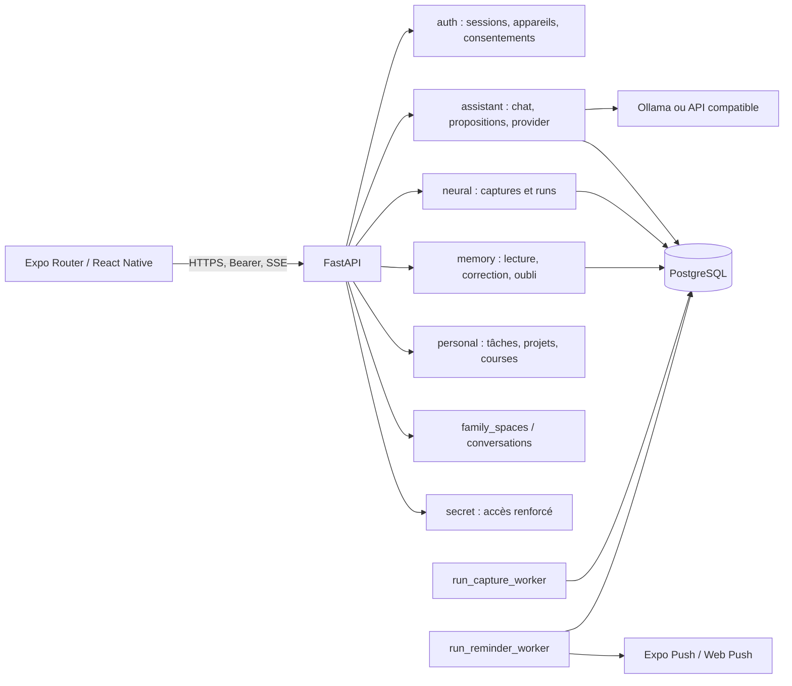

# 01 — Architecture réellement présente

> **Instantané initial.** Les changements mémoire du worktree ont été réévalués ensuite dans [02 — audit mémoire](02-memory-audit.md) et [10 — actions transversales](10-codebase-quality-actions.md). Pour l'état courant du retrieval et des migrations, ces deux documents priment sur les descriptions ci-dessous.

Audit statique du 8 octobre 2026. **[Code]** signifie observé dans le dépôt ; **[Non vérifié]** signifie qu'aucune instance déployée, base PostgreSQL réelle ni appareil Android n'a été interrogé. La référence produit est `docs/VISION.md`, notamment les sections 1–11, 25 et 72–75. Les chemins et numéros de ligne ci-dessous désignent l'état audité.

## Carte des composants

**[Code]** `app/main.py` enregistre les routeurs auth, audit, admin, assistant, personnel, neural, mémoire, conversations, secret, famille et temps réel. `core/database.py` construit une session SQLAlchemy synchrone ; le pool est adapté au mode serveur sans état / pooler transactionnel. Le schéma est versionné dans `apps/api/migrations/versions/`, jusqu'à `20261008_40_personal_memory.py` après welcome `20261006_39`. `core/config.py` centralise paramètres LLM, STT, push et tokens internes. Les URLs et clés fournisseur restent dans l'API. Le paramètre et le service Redis, sans usage runtime, ont été retirés ; seul le volume historique reste déclaré pour inventaire.

**[Code]** Expo SDK 57 (`apps/mobile/package.json:25-36`) utilise Expo Router (`app/_layout.tsx:110-115`), Zustand pour session et verrouillage secret (`src/stores/session-store.ts`, `secret-access-store.ts`), React Query pour les données d'écran (`app/_layout.tsx:21-24`, `app/assistant.tsx:125-137`) et un client HTTP/SSE partagé (`src/services/api.ts:740-810,931-1015`). Le refresh token est dans SecureStore en natif, localStorage sur web (`api.ts:1131-1152`). La séparation des données locales lors d'un changement de compte passe par `queryClient.clear()` et la purge de l'accès secret (`_layout.tsx:80-86`). Aucun cache de requêtes persistant sur disque n'a été constaté.

## Sept flux demandés

| Flux | État et preuve | Limite opérationnelle |
| --- | --- | --- |
| Connexion | **[Code]** token, session et appareil vérifiés par `auth/dependencies.py:30-65` ; restauration, renouvellement partagé et garde contre les opérations A/B tardives dans `session-store.ts` | **[Non vérifié]** comportement sur réseau lent et appareil réel |
| Envoi | **[Code]** `/api/assistant/chat/stream` persiste le message utilisateur avant inférence (`assistant/router.py:560-580`) ; clé d'idempotence et rejeu borné `:489-558` | Le verrou `_active_stream_turns` `:109-126` n'est que local au processus ; la contrainte DB et le rejeu doivent être éprouvés en multi-processus |
| Contexte | **[Code]** 10 messages, jusqu'à 12 souvenirs et trois listes personnelles (`assistant/context.py:34-117`, `assistant/kernel.py:36-68`) | Budget en caractères et comptes, pas en tokens ; pas de résumé d'historique |
| Réponse | **[Code]** provider interchangeable Ollama / OpenAI compatible (`assistant/providers.py:244-342`), exécution synchrone déportée du loop FastAPI (`assistant/router.py:602-612`) et SSE delta/complete/error `:615-642` | **[Non vérifié]** latence de première réponse et tenue sur LLM local réel |
| Extraction | **[Code]** le chat demande au LLM 0–2 mémoires candidates (`assistant/kernel.py:36-68,111-163`), crée des propositions (`assistant/router.py:301-339`) ; la capture est analysée par règles puis éventuellement LLM (`neural/service.py:53-84,260-300`, `neural/worker.py:250-371`) | Confirmation explicite nécessaire ; pas d'extraction durable autonome de tous les échanges |
| Stockage/recherche | **[Code]** confirmation d'une note vers `MemoryItem` ; recherche sur le corpus personnel autorisé avant `LIMIT`, FTS français PostgreSQL et vecteurs locaux optionnels (`memory/repository.py`, `retriever.py`) | Pertinence et plan SQL à qualifier sur PostgreSQL réel ; vecteurs désactivés par défaut |
| Affichage | **[Code]** bulle optimiste, retry, texte progressif et historique via React Query (`app/assistant.tsx:143-203,241-273,431-479`) | L'envoi dépend de la réponse du catalogue de modèles (`:131-142,241-243,553-580`) |

## Modèle relationnel et cycle de vie

**[Code]** L'identité se compose de `users`, `devices`, `sessions`, `user_consents` et des crédentiels/passkeys (`auth/models.py:19-211`). Un fil assistant par utilisateur (`assistant/models.py:36-63`) contient messages et propositions ; `memory_items` référence une capture, un run éventuel et un message source éventuel (`neural/models.py:123-166`). `CaptureRun` porte état, tentative et lease (`neural/models.py:81-105`). `NotificationOutbox` et appareils/abonnements portent la livraison (`assistant/models.py:149-190`, `auth/models.py:44-61,201-211`). Les conversations familiales utilisent membres et statuts distincts (`conversations/models.py:33-94`, `family_spaces/models.py:18-54`). Les conversations secrètes restent une frontière différente.

**[Code]** Les mémoires sont effacées logiquement ; les corrections créent une nouvelle version et l'oubli propage des exclusions aux descendants traçables (`memory/service.py`). La capture source peut rester présente après oubli ; une politique de conservation des textes source et d'effacement complet du compte doit être vérifiée avant de promettre l'oubli intégral. La migration mémoire ajoute un index GIN du plein texte français ; le stockage pgvector reste une installation séparée et facultative. Les requêtes et index doivent être jugés avec `EXPLAIN (ANALYZE, BUFFERS)` sur PostgreSQL isolé, pas inférés à partir de SQLite.

Inventaire statique des **43 tables ORM** (`Base.metadata` importée par `app.main`, sans lecture de la base réelle) ; `memory_vector_index` est créée séparément quand pgvector est configuré :

| Domaine | Tables déclarées | Usage observé |
| --- | --- | --- |
| Authentification | `users`, `devices`, `sessions`, `user_consents`, `secret_access_sessions`, `development_biometric_credentials`, `secret_biometric_credentials`, `secret_passkeys`, `secret_passkey_challenges`, `passkey_login_challenges`, `web_push_subscriptions` | Auth, accès secret, biométrie et push |
| Assistant | `assistant_threads`, `assistant_messages`, `assistant_proposals`, `proposal_executions`, `calendar_events`, `recurring_reminders`, `assistant_preferences`, `notification_outbox` | Chat, confirmations, calendrier, rappels et worker |
| Capture et mémoire | `captures`, `capture_runs`, `capture_run_events`, `memory_items`, `neural_proposals`, `memory_embeddings`, `memory_exclusions`, `working_memories`, `memory_usages`, `context_dependencies` | Capture, provenance, recherche, oubli et traçabilité |
| Personnel | `user_profiles`, `personal_tasks`, `personal_projects`, `grocery_lists`, `grocery_items`, `training_sessions`, `weight_check_ins` | Routes personnelles et outils assistant |
| Partage/messagerie | `family_spaces`, `family_space_members`, `conversations`, `conversation_members`, `messages`, `secret_notification_debounce` | Membership, messages et alertes protégées |
| Audit | `audit_events` | Télémétrie et lecture admin |

Les variantes biométriques et tables de challenge paraissent spécialisées par plateforme, pas manifestement inutiles. Sans volumétrie, dernière écriture ni inspection des workers en production, aucune table ne peut être déclarée supprimable.

## Inventaire fonctionnel et dette

| Présent | Partiel | Absent ou non vérifié |
| --- | --- | --- |
| Chat direct, SSE, choix/retry, modèle configurable, tâches/projets personnels, capture/runs, propositions confirmables, mémoire personnelle éditable, recherche FTS et indexation locale facultative, outbox push, messagerie familiale et secrète, audit HTTP, health/metrics | Classement et conflits encore heuristiques ; outil de lecture personnel borné ; réception push dont la livraison est inconnue | Résumés longs, budget exact de tokens du modèle, relations entre souvenirs, mémoire familiale dans l'assistant, tâches agentiques persistantes, tests Android réel/live LLM/production ; rétention complète des captures **[Non vérifié]** |

**[Hypothèse à vérifier]** Une table « inutilisée » ne se déduit pas de sa faible fréquence dans le code : elle peut servir à une migration, un worker ou des données historiques. Avant suppression, inventorier `Base.metadata`, routes, workers, FK, volumétrie par table, dernière écriture et restauration ; ne proposer un retrait qu'avec export et migration réversible.
