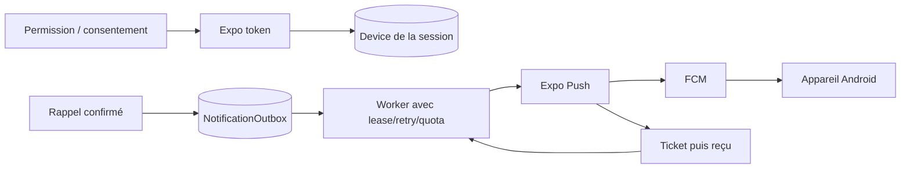

# 05 — Notifications Android : état et qualification

Le projet a **déjà** une base de notifications, contrairement à une intégration à concevoir de zéro. `expo-notifications` est présent en SDK 57 et déclaré dans `app.json` (`apps/mobile/package.json:25-36`, `app.json:10-13`). Le client crée un canal Android avant de demander un Expo push token, vérifie permission et `projectId`, puis transmet le token à l'API (`src/services/notifications.ts:142-175`). L'API rattache ce token à l'appareil de la session authentifiée (`auth/router.py:313-327`), tandis que l'outbox, le worker, les tickets, reçus, retries et quotas sont présents (`assistant/models.py:149-190`, `commands/run_reminder_worker.py:97-477`). Web Push est un chemin séparé (`notifications.ts:93-140`, `auth/models.py:201-211`).

**[Non vérifié]** Aucun envoi/réception Android réel, FCM credential, permission sur Android 13+, comportement application fermée, ni planification de production n'a été testé pendant cet audit. La [documentation Expo SDK 57](https://docs.expo.dev/versions/v57.0.0/sdk/notifications/) confirme le canal préalable au token et la nécessité d'une development build pour les push distants Android ; Expo Go ne suffit pas. La [documentation des reçus](https://docs.expo.dev/push-notifications/sending-notifications/) précise qu'un ticket ou reçu positif ne prouve pas l'affichage sur l'appareil.

## Flux actuel

Le worker prend les appareils de `item.user_id` et abonnements web du même utilisateur (`run_reminder_worker.py`), retire les tokens invalides et consulte les reçus. Le test de notification ne cible que l'appareil d'origine. La révocation du consentement supprime les tokens (`auth/router.py`) et le worker recontrôle `notifications.push` après prise en charge de l'outbox, avant l'envoi ; un test couvre la révocation. La désinscription Web Push provoquée par une déconnexion revérifie que cette session est encore courante après les attentes du navigateur ; un test empêche une ancienne déconnexion de retirer l'abonnement du nouveau compte. Les alertes de messagerie protégée possèdent un debounce et un contenu générique (`secret/notifications.py`, `docs/SECRET_NOTIFICATIONS.md`), qu'il faut préserver sur écran verrouillé.

## Travail restant, dans l'ordre

1. **P1 — Qualifier la chaîne native.** Vérifier package ID, `projectId`, credential FCM du build, permission, canal, token enregistré, worker effectivement lancé, ticket/reçu, affichage et navigation sur un Android réel. Test avec deux comptes et deux appareils. Critère : B ne reçoit jamais un outbox de A, même après changement de compte. Complexité moyenne ; dépend de build et provider live.
2. **P1 — Vérifier l'exploitation du worker.** `run_reminder_worker.py:473-477` et `/api/internal/notifications` (`assistant/worker_router.py:10-25`) permettent l'exécution, mais il faut confirmer une planification durable, alertes en cas de retard, relance et supervision dans l'environnement choisi. Le token de route interne doit rester privé ; sauvegarder l'outbox. Complexité moyenne.
3. **P1 — Confidentialité/consentement.** Le contrôle `notifications.push` avant envoi est ajouté et testé localement. Vérifier encore la course entre ce contrôle et l'appel réseau, les heures silencieuses, quota et fuseau sur l'infrastructure réelle. Garder titres et corps génériques pour les informations sensibles ; le choix du contenu visible doit être explicite pour chaque catégorie.
4. **P2 — Capacités futures.** Rappels issus de tâches/projets et notifications de tâche terminée via l'outbox existante, avec `dedupe_key`, destinataire authentifié, type et action sûrs. La proactivité nécessitera une préférence et un consentement propres, pas une extension implicite du consentement aux rappels. Complexité moyenne.

En cas de provider indisponible, ne pas perdre l'événement métier : l'outbox est l'état durable, les tentatives sont bornées et les échecs deviennent visibles. Un reçu `ok` signifie remise à FCM, pas lecture par l'utilisateur. Suivre `queued_at`, `sent_at`, âge des éléments en attente, erreurs sûres et nombre de tokens invalides sans journaliser les tokens.
