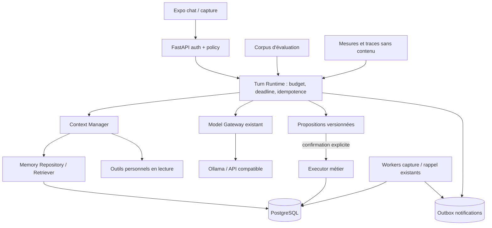

# 06 — Architecture cible progressive

> **Mise à jour du worktree :** embeddings/pgvector et worker mémoire existent désormais derrière des drapeaux désactivés par défaut. Leur activation reste conditionnée à une qualification et à un gain mesuré ; voir [02 — audit mémoire](02-memory-audit.md) et [07 — roadmap](07-roadmap.md).

Décision : **conserver le monolithe FastAPI, PostgreSQL et Expo** pour les ~10 utilisateurs initiaux. Les modules nommés ci-dessous sont des responsabilités Python, pas des services autonomes. Cette trajectoire reprend `docs/VISION.md:1-48,928-968,2341-2399,2514-2617` : boucle de message fiable, mémoire personnelle isolée, LLM local lent accepté, partage familial seulement sur permission explicite.

## KEEP / REFACTOR / ADD / REMOVE

| Décision | Composants et raison |
| --- | --- |
| **KEEP** | `auth/dependencies.py`, `assistant/providers.py`, SSE/idempotence du chat, `memory/repository.py`, `MemoryItem`, `assistant/tools.py`, propositions/executor, workers, outbox, React Query/Zustand, frontière `secret`. Ils adressent déjà sécurité, provider remplaçable et reprise. |
| **REFACTOR ciblé** | La troncature à 100 avant pertinence, le doublon de contexte et le blocage du chat par le catalogue sont corrigés localement. Qualifier le plan SQL, les tokens du modèle et le classement ; améliorer les contradictions par sujet/portée/temps. |
| **ADD seulement avec preuve de besoin** | Corpus reproductible, instrumentation latence/tokens, résumé long, FTS puis embeddings si gain ; permissions familiales de mémoire, tâches agentiques durables, consentement proactif. |
| **REMOVE** | L'ancien helper de résumés mémoire, le paramètre Redis, le service Redis et le prototype Hermes sans import runtime ont été retirés. Le volume Redis historique reste déclaré pour inventaire avant suppression physique. La colonne et la migration Hermes historiques restent tant que leurs données ne sont pas inventoriées. |

## Chemin d'un tour

1. Authentifier la session et vérifier `enable_assistant`/consentements côté serveur. Le client ne transmet jamais un `owner_id` libre. Enregistrer le message avec clé d'idempotence, puis libérer la transaction avant l'inférence longue (contrat actuel `assistant/router.py:560-580`).
2. Route déterministe : salutation ou question de contexte immédiat peut ignorer le retrieval ; question personnelle lance une recherche SQL filtrée par droits **avant** score/top-k. Les projets personnels et espaces familiaux restent distincts ; aucune donnée de messagerie secrète n'entre dans le contexte. Une mémoire familiale exige membership + portée explicite et ne fusionne pas les préférences de membres (`VISION.md:286-431`).
3. Construire le prompt selon la fenêtre effective du modèle : réserver la réponse, plafonner historique, résumé, souvenirs et outils par tokens ; inclure provenance, état et validité ; dédupliquer. Les mémoires sont des données non fiables, jamais des instructions ou preuves d'autorisation. Pour petit LLM, préférer listes courtes et format simple validé ; texte naturel reste fallback sûr. La recherche et les outils ne sont appelés que s'ils peuvent changer la réponse.
4. Streamer des états correspondant à une action réelle et la réponse ; à succès, enregistrer l'assistant puis générer au plus quelques propositions de mémoire. Extraction durable après confirmation, ou extraction différée si elle alourdit le premier token. Si l'appel échoue/est annulé, conserver le message utilisateur et offrir un retry idempotent.
5. Les actions passent par le registry/les schémas Pydantic et la proposition versionnée existants ; validation de propriétaire, consentement et arguments **après** décision du modèle. Les notifications utilisent outbox et worker. Journaliser des durées, comptes, états et erreurs sûrs, sans prompts ni secrets.

Une boucle multi-étapes n'est utile que pour une tâche explicite impossible en un seul appel. Dans cette future voie : maximum d'itérations et d'appels outils configurables, budget tokens/temps par tâche, schémas d'arguments stricts, arrêt/annulation, résultats d'outils bornés, sauvegarde d'étape et reprise idempotente. Les actions sensibles demandent confirmation API. Aucun shell générique, outil d'accès DB brut ou multi-agent n'est nécessaire pour le premier palier.

## Points de défaillance et exploitation

LLM indisponible : message durable, erreur SSE, retry, limite de concurrence déjà présente (`assistant/providers.py:49-64,100-127`) ; ne pas raccourcir arbitrairement le délai de lecture d'Ollama, mais borner connexion, pool et arrêt utilisateur. DB indisponible : échec explicite, aucune génération non journalisée ; sauvegarde/restore à tester. Worker arrêté : âge de queue et alerte. Push accepté sans reçu : surveiller et relancer la collecte. Cache mobile : clés par utilisateur et purge au changement de compte. Les métriques HTTP actuelles (`core/metrics.py:7-40`) doivent être complétées par temps de retrieval, premier token, tokens réels/estimés, taux de proposition confirmée, échecs et lag de worker, avec labels de faible cardinalité.

**RLS** reste une défense optionnelle après inventaire PostgreSQL (voir `03-security-multiuser.md`). **pgvector** reste conditionnel au corpus d'évaluation (voir `02-memory-audit.md`). Cette architecture peut augmenter la capacité en ajoutant des workers et en maîtrisant la concurrence du LLM ; elle ne promet pas une capacité chiffrée sans test de charge réel.
